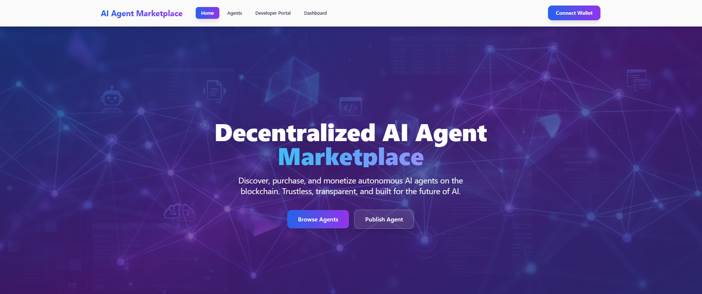

# Decentralized AI Agent Marketplace
A blockchain-based marketplace for publishing, monetizing, and trading autonomous AI agents.

---

### Home Page


---

## Quick Start

**Prerequisites:** Node.js 18+ (`node --version`)

```bash
npm run setup
npm run dev
```

- **Frontend:** http://localhost:5173
- **Backend API:** http://localhost:3001/health

Stop: `Ctrl+C` in the terminal.

---

## Project Structure

This project uses **npm workspaces** (monorepo):

```
ai-agent-marketplace/
├── package.json          # Root workspace
├── frontend/             # React frontend (Vite, Tailwind, Ethers.js)
├── backend/              # Express backend (mock data)
└── contracts/            # Smart contracts (Hardhat, Solidity)
```

---

## Development Commands

From the **root directory**:

```bash
npm run setup              # Install all dependencies
npm run dev                # Start both frontend and backend
npm run dev:frontend       # Start frontend only
npm run dev:backend        # Start backend only
npm run build:frontend     # Build frontend for production
npm run build:contracts    # Compile smart contracts
npm run test:contracts     # Run contract tests
```

---

## Documentation

- **[SETUP.md](SETUP.md)** - Setup guide
- **[docs/CONTEXT.md](docs/CONTEXT.md)** - What's implemented vs. in progress
- **[docs/LIMITATIONS.md](docs/LIMITATIONS.md)** - Current limitations

---

## Tech Stack

**Frontend:** React 18+, Vite, Tailwind CSS, Ethers.js, React Router  
**Backend:** Node.js 18+, Express.js, mock data (no database for PoC)  
**Blockchain:** Solidity 0.8+, Hardhat, Ethereum Testnet (Sepolia)

---

## Status

**Proof of Concept:** Project structure, basic contracts, frontend and backend foundations in place. Full feature implementation in progress.

---

*Proof of concept for the decentralized AI agent marketplace.*
